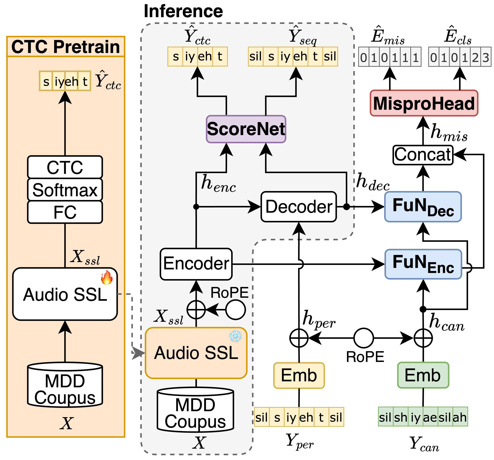
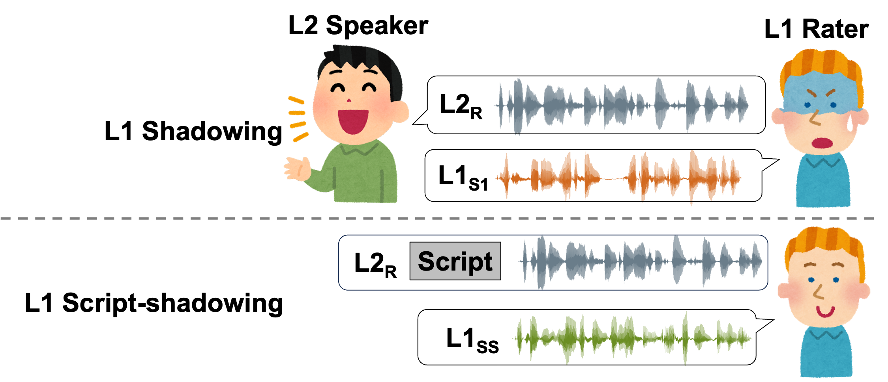
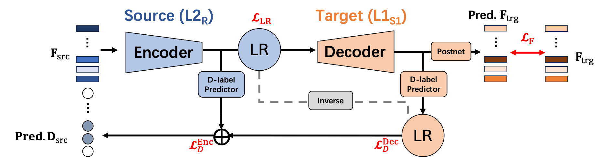

Haopeng Geng is currently pursuing a Ph.D. at The University of Tokyo. His research interests lie in solving atypical speech phenomena, such as L2 speech, accented speech, and pathological speech, using deep learning and signal processing methods.

Before joining UTokyo, he worked as an AI software engineer at Laronix, an Australian start-up company that developed the world’s first pneumatic larynx. In this role, he was responsible for evaluating and improving the speech quality of products designed for the voice loss community. He earned his M.S. and B.S. degrees from Nagoya University and Dalian University of Technology (DLUT), respectively.

# 📝 Publications 

Submitted to ICASSP 2026

- [IF-MDD: Indirect Fusion for Prompt-free Mispronunciation Detection and Diagnosis](../docs/Geng_ICASSP_2026_final.pdf) \\
  <ins>**Haopeng Geng**</ins>, Saito Daisuke, Nobuaki Minematsu. 
  +	**Prompt-free Mispronunciation Detection** - Developed IF-MDD, an indirect fusion framework that leverages canonical phonemes only during training, enabling inference without text prompts.
	+	**Strong Diagnostic Performance** - Achieved 60.67% F1 and 19.98% error diagnosis rate on L2-ARCTIC, showing competitive results even with limited training data.
	+	**Robust Generalization** - Demonstrated reliable performance across unseen speakers from diverse L1 backgrounds, highlighting scalability for real-world CALL applications.
  + [🎧Demo](https://secondtonumb.github.io/publication_demo/ICASSP_2026/index.html)
  + [Open Source Code](https://github.com/Secondtonumb/IF-MDD)

Interspeech 2025

  

- [A Perception-Based L2 Speech Intelligibility Indicator: Leveraging a Rater’s Shadowing and Sequence-to-sequence Voice Conversion](https://arxiv.org/pdf/2505.24304) \\
<ins>**Haopeng Geng**</ins>, Saito Daisuke, Nobuaki Minematsu. 
	+ **Customized Intelligibility Indicator** – Proposed a novel metric leveraging native raters’ shadowing data, focusing on perceptual cues rather than purely native-like pronunciation.
	+ **Seq2Seq Voice Conversion Framework** – Applied alignment and acoustic reconstruction modules to simulate how native listeners detect unintelligible segments.
	+ **Multi-Task Learning for Feedback** – Jointly optimized speech reconstruction and disfluency detection, achieving closer alignment with native raters’ judgments than mainstream ASR and enabling more personalized CALL feedback.
  + [🎧Demo](https://secondtonumb.github.io/publication_demo/IS_2025/index.html)

- [Synthesizing True Golden Voices to Enhance Pronunciation Training for Individual Language Learners](https://www.isca-archive.org/slate_2025/yamanaka25_slate.pdf) \\
Ryoga Yamanaka, Kento Osa, Akari Fujiwara, <ins>**Haopeng Geng**</ins>, Daisuke Saito, Nobuaki Minematsu, Yusuke Inoue. **Accepted by SlaTE 2025**.

- [Simulating Native Speaker Shadowing for Nonnative Speech Assessment with Latent Speech Representations](https://arxiv.org/pdf/2409.11742) \\
<ins>**Haopeng Geng**</ins>, Saito Daisuke, Nobuaki Minematsu \\
[🎧Demo](https://secondtonumb.github.io/publication_demo/ICASSP_2025/index.html)

- [A Pilot Study of Applying Sequence-to-Sequence Voice Conversion to Evaluate the Intelligibility of L2 Speech Using a Native Speaker’s Shadowings](https://arxiv.org/pdf/2410.02239) \\
<ins>**Haopeng Geng**</ins>, Saito Daisuke, Nobuaki Minematsu. **Accepted by APSIPA 2024**. \\
[🎧Demo](https://secondtonumb.github.io/publication_demo/APSIPA_2024/index.html), 

- [Disfluency Removal with Speech Inpainting on Spontaneous Lecture Speech](https://jglobal.jst.go.jp/detail?JGLOBAL_ID=202202243418490606) \\
<ins>**Haopeng Geng**</ins>, YASUDA Yusuke, Tomoki Toda. **ASJ 2022**

# 📖 Educations
- *2024.04 - Present*,
  - Ph.D Candicates. in Engineering, The University of Tokyo, Japan. 
  - Supervisor: [Prof. Nobuaki Minematsu](https://www.gavo.t.u-tokyo.ac.jp/~mine/profile.html).
- *2020.04 - 2022.03*
  - M.S. in Informatics, Nagoya University, Japan.  
  - Supervisor: [Prof. Tomoki Toda](https://sites.google.com/site/tomokitoda/home_eng).
- *2014.09 - 2019.06*
  - B.S. in Computer Science and Technology, Dalian University of Technology,
  - B.A. in Japanese, Dalian University of Technology, China.

# 💬 Work Experiences
- *2022.07 - 2023.12*, Technical Assistant, [Nagoya University](https://icts.nagoya-u.ac.jp/ja/center/),
- *2022.03 - 2024.10*, AI Software Engineer, [Laronix](https://www.laronix.com/), Australia.

# 🎖 Honors and Awards
- *2024.03* [SPRING-GX](https://www.cis-trans.jp/spring_gx/) Scholarship, University of Tokyo.
- *2022.04* [Graduate program for real-world data circulation leaders](https://www.leading.nagoya-u.ac.jp/eng/program/program05.html), Nagoya University.
- *2017.09* Scholarship for outstanding undergraduate students, CSC.

# 💻 Internships
- *2025.03 - 2025.09*, Software Engineer, [CoeFont](https://coefont.cloud/),
- *2025.01 - 2025.09*, Research Assistant, [Carriage inc.](https://www.carri-age.com/),
- *2021.08*, [NTT Human Informatics Laboratories](https://www.rd.ntt/e/hil/), Japan.