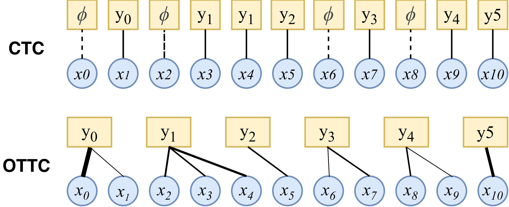
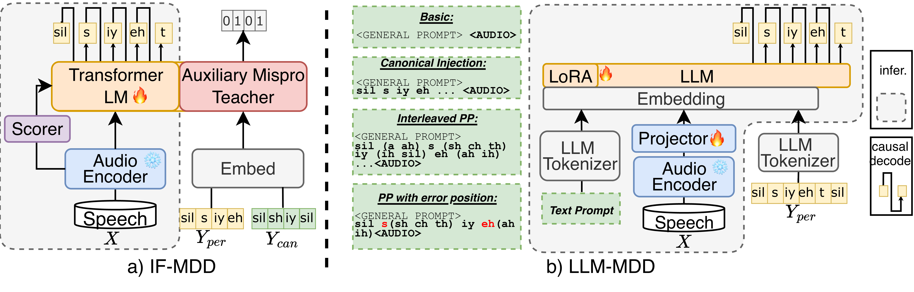
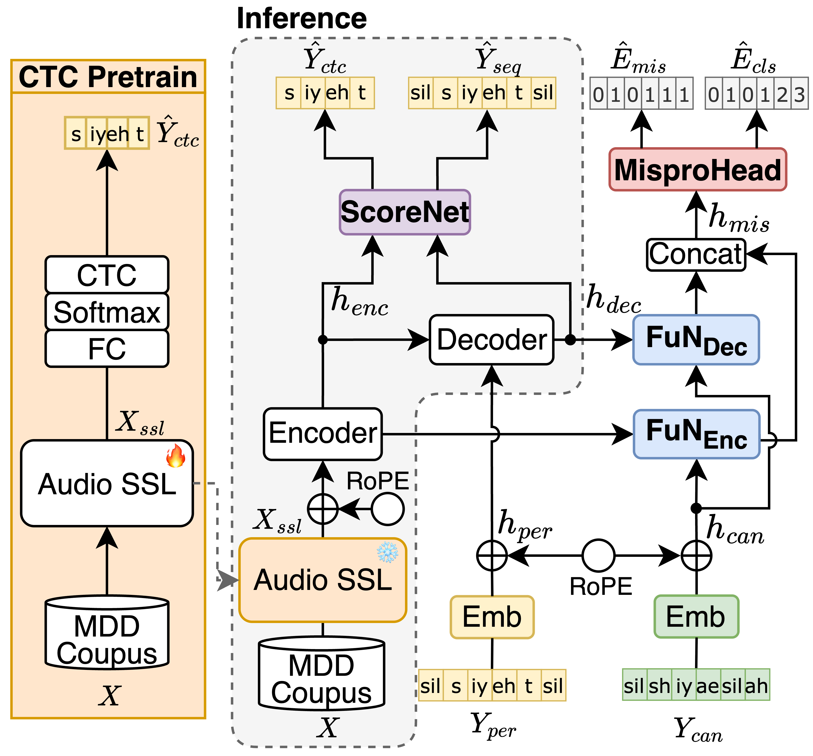
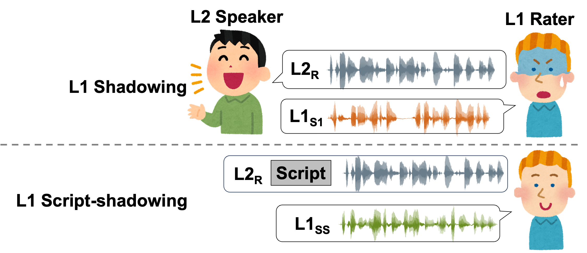
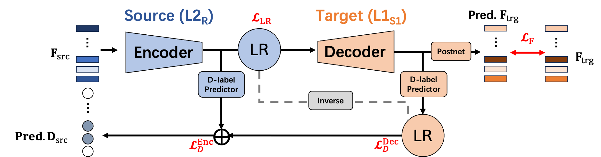

Haopeng (Kevin) Geng is a Ph.D. candidate in the Department EEIS at the University of Tokyo. His research interests lie in solving atypical speech phenomena, such as L2 speech, accented speech, and pathological speech, using deep learning and signal processing methods.

Before joining UTokyo, he worked as an AI software engineer at Laronix, an Australian start-up company that developed the world’s first pneumatic larynx. In this role, he was responsible for evaluating and improving the speech quality of products designed for the voice loss community. He earned his M.S. and B.S. degrees from Nagoya University and Dalian University of Technology (DLUT), respectively.

# 📣 News

* **[Feb 2026]** 🥈 Our team **Utokyo** ranked **2nd Place** in the [Iqra'Eval2 Challenge](https://huggingface.co/spaces/IqraEval/Leaderboard) at **INTERSPEECH 2026**! \\
   Check out our [Prompt-free MDD paper](https://secondtonumb.github.io/docs/IS2026.pdf), [Code](https://github.com/Secondtonumb/IF-MDD/) and [Checkpoints](https://huggingface.co/Haopeng/iqra_IFMDD_Con)!

* **[Aug 2025]** 🚀 We have open-sourced the full implementation of **IF-MDD**, our prompt-free paradigm for mispronunciation detection and diagnosis! 

* **[Feb 2025]** 🎉 Our paper on **Perception-Based L2 Intelligibility** has been accepted for presentation at **INTERSPEECH 2025**! \\
   Read the [Paper](https://www.isca-archive.org/interspeech_2025/geng25_interspeech.pdf) and explore the [Demo](https://secondtonumb.github.io/publication_demo/IS_2025/index.html) of our shadowing-based framework.

# 📝 Publications 

  

    

      
Submitted to INTERSPEECH 2026

      
      
    

  

  

- [Beyond Acoustic Sparsity and Linguistic Bias: A Prompt-Free Paradigm for Mispronunciation Detection and Diagnosis](https://secondtonumb.github.io/IS2026.pdf) \\
  <ins>**Haopeng Geng**</ins>, Longfei Yang, Xi Chen et al. 

  

    🥈 <strong>Ranked <a href="https://huggingface.co/spaces/IqraEval/Leaderboard" target="_blank" style="color: #5c3e0d; font-weight: bold; text-decoration: underline;">2nd</a></strong> in the <strong><a href="https://huggingface.co/spaces/IqraEval/Leaderboard" target="_blank" style="color: #5c3e0d; text-decoration: none;">Iqra'Eval2 Challenge 2026!!</a></strong>
  

  + **CROTTC Front-end** - Proposed a highly sensitive acoustic front-end to capture fine-grained phonetic deviations, effectively mitigating the **acoustic sparsity** inherent in traditional CTC-based MDD systems.
  + **Indirect Fusion & Prompt-free Inference** - Developed a knowledge transfer paradigm to integrate pronunciation-specific cues into language models, enabling **prompt-free inference** while maintaining highly competitive cross-lingual performance.
  + **LLM Limitation Analysis** - Conducted a systematic investigation into why Large Language Models struggle with **faithful, fine-grained phonetic recognition**, shedding light on the critical trade-off between linguistic priors and acoustic evidence.

Submitted to ICASSP 2026

- [IF-MDD: Indirect Fusion for Prompt-free Mispronunciation Detection and Diagnosis](https://secondtonumb.github.io/ICASSP2026.pdf) \\
  <ins>**Haopeng Geng**</ins>, Daisuke Saito, Nobuaki Minematsu. \\
  🎧[Demo](https://secondtonumb.github.io/publication_demo/ICASSP_2026/index.html), 💻[Github Repo](https://github.com/Secondtonumb/IF-MDD) \\
  + **Prompt-free Mispronunciation Detection** - Developed IF-MDD, an indirect fusion framework that leverages canonical phonemes only during training, enabling inference without text prompts.
  + **Strong Diagnostic Performance** - Achieved 60.67% F1 and 19.98% error diagnosis rate on L2-ARCTIC, showing competitive results even with limited training data.
  + **Robust Generalization** - Demonstrated reliable performance across unseen speakers from diverse L1 backgrounds, highlighting scalability for real-world CALL applications.

Interspeech 2025

  

- [A Perception-Based L2 Speech Intelligibility Indicator: Leveraging a Rater’s Shadowing and Sequence-to-sequence Voice Conversion](https://www.isca-archive.org/interspeech_2025/geng25_interspeech.pdf) \\
<ins>**Haopeng Geng**</ins>, Daisuke Saito, Nobuaki Minematsu. \\
🎧[Demo](https://secondtonumb.github.io/publication_demo/IS_2025/index.html)
	+ **Customized Intelligibility Indicator** – Proposed a novel metric leveraging native raters’ shadowing data, focusing on perceptual cues rather than purely native-like pronunciation.
	+ **Seq2Seq Voice Conversion Framework** – Applied alignment and acoustic reconstruction modules to simulate how native listeners detect unintelligible segments.
	+ **Multi-Task Learning for Feedback** – Jointly optimized speech reconstruction and disfluency detection, achieving closer alignment with native raters’ judgments than mainstream ASR and enabling more personalized CALL feedback.

- 
SlaTE 2025
 \\
[Synthesizing True Golden Voices to Enhance Pronunciation Training for Individual Language Learners](https://www.isca-archive.org/slate_2025/yamanaka25_slate.pdf) \\
Ryoga Yamanaka, Kento Osa, Akari Fujiwara, <ins>**Haopeng Geng**</ins>, Daisuke Saito, Nobuaki Minematsu, Yusuke Inoue.

- 
Submitted to ICASSP 2025
 \\
[Simulating Native Speaker Shadowing for Nonnative Speech Assessment with Latent Speech Representations](https://arxiv.org/pdf/2409.11742) \\
<ins>**Haopeng Geng**</ins>, Daisuke Saito, Nobuaki Minematsu \\
🎧[Demo](https://secondtonumb.github.io/publication_demo/ICASSP_2025/index.html)

- 
APSIPA ASC 2024
 \\
[A Pilot Study of Applying Sequence-to-Sequence Voice Conversion to Evaluate the Intelligibility of L2 Speech Using a Native Speaker’s Shadowings](https://arxiv.org/pdf/2410.02239) \\
<ins>**Haopeng Geng**</ins>, Daisuke Saito, Nobuaki Minematsu. **Accepted by APSIPA 2024**. \\
🎧[Demo](https://secondtonumb.github.io/publication_demo/APSIPA_2024/index.html), 
💻[Github Repo](https://github.com/Secondtonumb/virtual_shadower)
- 
ASJ 2022
 \\
[Disfluency Removal with Speech Inpainting on Spontaneous Lecture Speech](https://jglobal.jst.go.jp/detail?JGLOBAL_ID=202202243418490606) \\
<ins>**Haopeng Geng**</ins>, YASUDA Yusuke, Tomoki Toda. 

# 📖 Educations
- *2024.04 - Present*,
  - Ph.D Candicates. in Engineering, The University of Tokyo, Japan. 
  - Supervisor: [Prof. Nobuaki Minematsu](https://www.gavo.t.u-tokyo.ac.jp/~mine/profile.html).
- *2020.04 - 2022.03*
  - M.S. in Informatics, Nagoya University, Japan.  
  - Supervisor: [Prof. Tomoki Toda](https://sites.google.com/site/tomokitoda/home_eng).
- *2014.09 - 2019.06*
  - B.S. in Computer Science and Technology, Dalian University of Technology,
  - B.A. in Japanese, Dalian University of Technology, China.

# 💬 Work Experiences
- *2022.07 - 2023.12*, Technical Assistant, [Nagoya University](https://icts.nagoya-u.ac.jp/ja/center/),
- *2022.03 - 2024.10*, AI Software Engineer, [Laronix](https://www.laronix.com/), Australia.

# 🎖 Honors and Awards
- *2026.02* [Iqra'Eval2 Challenge](Leaderboard) 🥈 2nd place, INTERSPEECH 2026.
- *2024.03* [SPRING-GX](https://www.cis-trans.jp/spring_gx/) Scholarship, University of Tokyo.
- *2022.04* [Graduate program for real-world data circulation leaders](https://www.leading.nagoya-u.ac.jp/eng/program/program05.html), Nagoya University.
- *2017.09* Scholarship for outstanding undergraduate students, CSC.

# 💻 Internships
- *2025.03 - 2025.09*, Software Engineer, [CoeFont](https://coefont.cloud/),
- *2025.01 - 2025.09*, Research Assistant, [Carriage inc.](https://www.carri-age.com/),
- *2021.08*, [NTT Human Informatics Laboratories](https://www.rd.ntt/e/hil/), Japan.