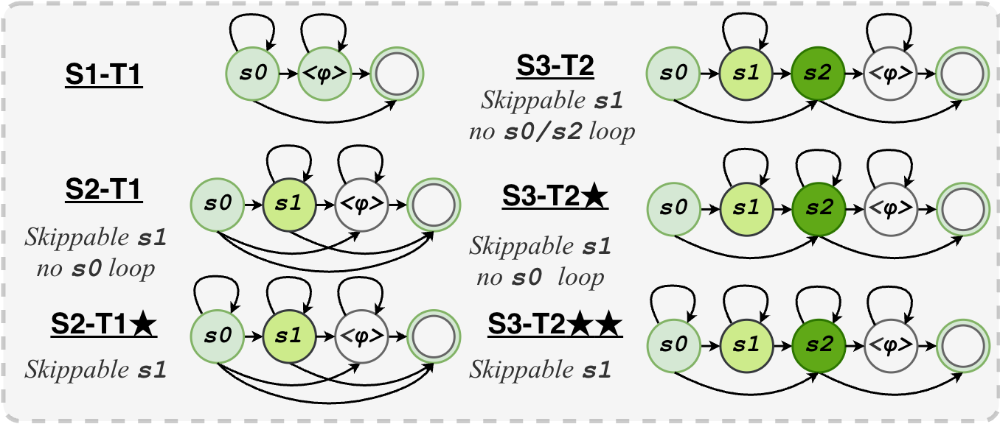
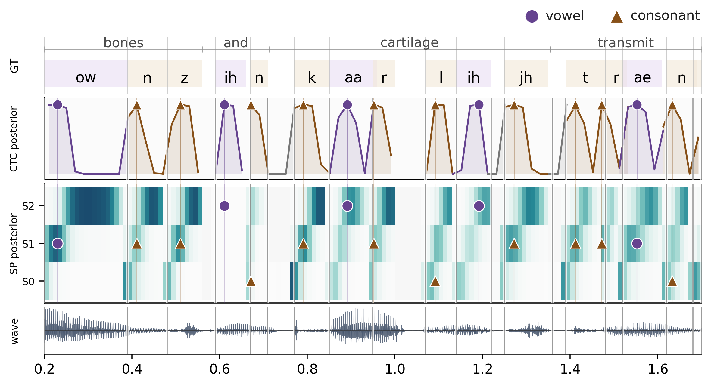
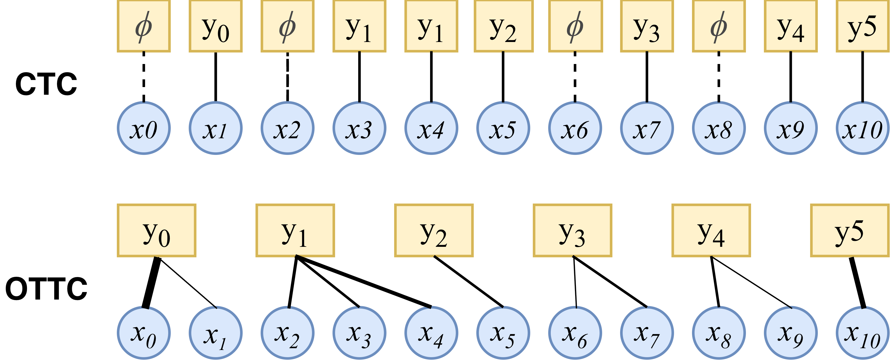
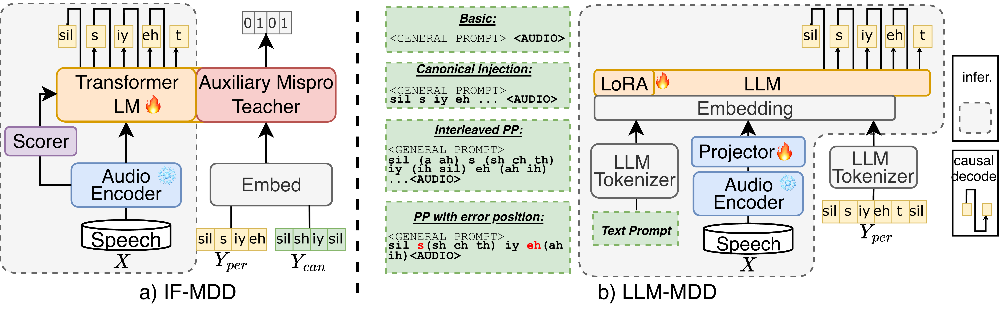
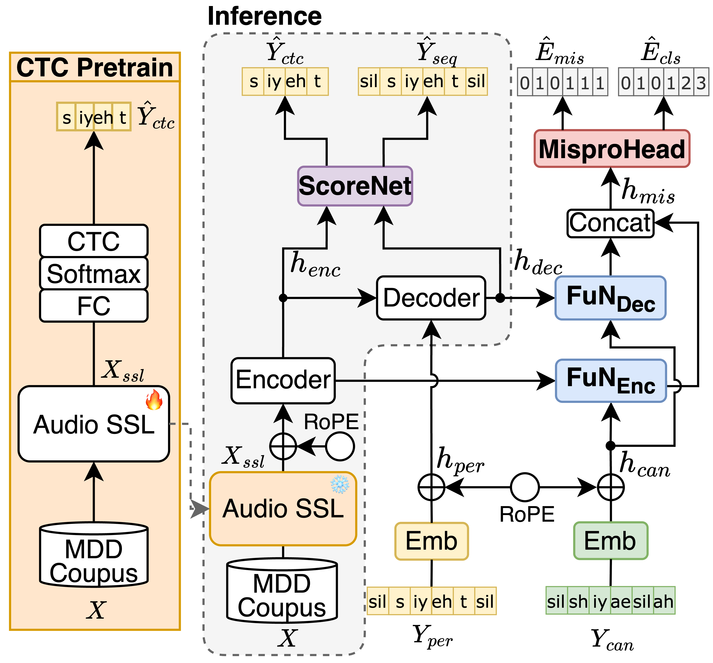
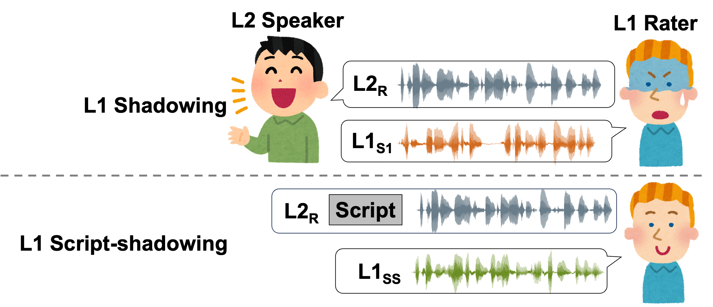
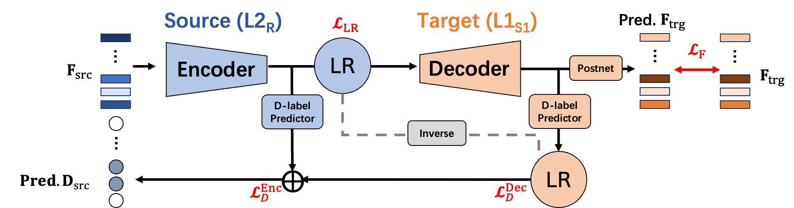

Haopeng Geng is a Ph.D. candidate in Electrical Engineering and Information Systems at the University of Tokyo. His research in Human-Centered Speech AI develops perceptually meaningful acoustic and phonetic models and speech representations for understanding L2, accented, and pathological speech.

Before beginning his Ph.D., he worked full-time as an AI Software Engineer at [Laronix](https://www.laronix.com/), an Australian MedTech start-up, developing practical speech technologies to support communication for the voice-loss community.

  Human-Centered Speech AI
  Fine-Grained Acoustic Modeling
  Speech Representation Learning
  Phonetic Foundation Models
  Speech-Language Models
  Speech Accessibility

# 📣 News

* **[Feb 2026]** 🥈 Our UTokyo team placed **2nd** in the [Iqra'Eval2 Challenge](https://huggingface.co/spaces/IqraEval/Leaderboard) at **INTERSPEECH 2026**. \\
   See our [prompt-free MDD paper](https://secondtonumb.github.io/IS2026.pdf), [code](https://github.com/Secondtonumb/IF-MDD/), and [checkpoints](https://huggingface.co/Haopeng/iqra_IFMDD_Con).

* **[Aug 2025]** We released the full implementation of **IF-MDD**, our prompt-free framework for mispronunciation detection and diagnosis.

* **[Feb 2025]** Our paper on **perception-based L2 intelligibility** was accepted at **INTERSPEECH 2025**. \\
   Read the [paper](https://www.isca-archive.org/interspeech_2025/geng25_interspeech.pdf) and explore the [demo](https://secondtonumb.github.io/publication_demo/IS_2025/index.html) of our shadowing-based framework.

# 📝 Publications 

  

    

      
Submitted to SLT 2026

      
      
    

  

  

- [Subphonetic Acoustic Modeling via Optimal Transport for Pronunciation Assessment](https://secondtonumb.github.io/docs/SLT2026_double_blind.pdf) \\
  Double Blind Review. 

  + **Subphonetic Acoustic Modeling** - Expands each phone into ordered internal states, producing dense frame-level acoustic evidence beyond sparse CTC peaks.
  + **Optimal Transport Training** - Learns monotonic frame-to-state alignments with topology-aware optimal temporal transport, without requiring manual frame labels.
  + **Pronunciation Assessment** - Provides more precise phone-internal timing and acoustic cues for segmentation, mispronunciation detection, and automatic pronunciation assessment.

  

    

      
INTERSPEECH 2026 (Long Paper)

      
      
    

  

  

- [Beyond Acoustic Sparsity and Linguistic Bias: A Prompt-Free Paradigm for Mispronunciation Detection and Diagnosis](https://secondtonumb.github.io/IS2026.pdf) \\
  <ins>**Haopeng Geng**</ins>, Longfei Yang, Xi Chen et al. 

  

    🥈 <strong>Ranked <a href="https://huggingface.co/spaces/IqraEval/Leaderboard" target="_blank">2nd</a></strong> in the <strong><a href="https://huggingface.co/spaces/IqraEval/Leaderboard" target="_blank">Iqra'Eval2 Challenge 2026</a></strong>
  

  + **CROTTC Front-end** - Introduces a dense acoustic front-end for capturing fine-grained phonetic deviations beyond the sparse peaks produced by conventional CTC models.
  + **Indirect Fusion & Prompt-free Inference** - Transfers pronunciation-specific cues into a language model during training, enabling inference without a text prompt.
  + **LLM Limitation Analysis** - Examines how linguistic priors can override acoustic evidence in fine-grained phonetic recognition.

Preprint, 2026

- [IF-MDD: Indirect Fusion for Prompt-free Mispronunciation Detection and Diagnosis](https://secondtonumb.github.io/ICASSP2026.pdf) \\
  <ins>**Haopeng Geng**</ins>, Daisuke Saito, Nobuaki Minematsu. \\
  🎧[Demo](https://secondtonumb.github.io/publication_demo/ICASSP_2026/index.html), 💻[GitHub Repo](https://github.com/Secondtonumb/IF-MDD) \\
  + **Prompt-free Mispronunciation Detection** - Developed IF-MDD, an indirect fusion framework that leverages canonical phonemes only during training, enabling inference without text prompts.
  + **Strong Diagnostic Performance** - Achieved 60.67% F1 and 19.98% error diagnosis rate on L2-ARCTIC, showing competitive results even with limited training data.
  + **Robust Generalization** - Demonstrated reliable performance across unseen speakers from diverse L1 backgrounds, highlighting scalability for real-world CALL applications.

INTERSPEECH 2025

  

- [A Perception-Based L2 Speech Intelligibility Indicator: Leveraging a Rater’s Shadowing and Sequence-to-sequence Voice Conversion](https://www.isca-archive.org/interspeech_2025/geng25_interspeech.pdf) \\
<ins>**Haopeng Geng**</ins>, Daisuke Saito, Nobuaki Minematsu. \\
🎧[Demo](https://secondtonumb.github.io/publication_demo/IS_2025/index.html)
	+ **Customized Intelligibility Indicator** – Proposed a novel metric leveraging native raters’ shadowing data, focusing on perceptual cues rather than purely native-like pronunciation.
	+ **Seq2Seq Voice Conversion Framework** – Applied alignment and acoustic reconstruction modules to simulate how native listeners detect unintelligible segments.
	+ **Multi-Task Learning for Feedback** – Jointly optimized speech reconstruction and disfluency detection, achieving closer alignment with native raters’ judgments than mainstream ASR and enabling more personalized CALL feedback.

- 
SlaTE 2025
 \\
[Synthesizing True Golden Voices to Enhance Pronunciation Training for Individual Language Learners](https://www.isca-archive.org/slate_2025/yamanaka25_slate.pdf) \\
Ryoga Yamanaka, Kento Osa, Akari Fujiwara, <ins>**Haopeng Geng**</ins>, Daisuke Saito, Nobuaki Minematsu, Yusuke Inoue.

- 
Preprint, 2025
 \\
[Simulating Native Speaker Shadowing for Nonnative Speech Assessment with Latent Speech Representations](https://arxiv.org/pdf/2409.11742) \\
<ins>**Haopeng Geng**</ins>, Daisuke Saito, Nobuaki Minematsu \\
🎧[Demo](https://secondtonumb.github.io/publication_demo/ICASSP_2025/index.html)

- 
APSIPA ASC 2024
 \\
[A Pilot Study of Applying Sequence-to-Sequence Voice Conversion to Evaluate the Intelligibility of L2 Speech Using a Native Speaker’s Shadowings](https://arxiv.org/pdf/2410.02239) \\
<ins>**Haopeng Geng**</ins>, Daisuke Saito, Nobuaki Minematsu. \\
🎧[Demo](https://secondtonumb.github.io/publication_demo/APSIPA_2024/index.html), 
💻[GitHub Repo](https://github.com/Secondtonumb/virtual_shadower)
- 
ASJ 2022
 \\
[Disfluency Removal with Speech Inpainting on Spontaneous Lecture Speech](https://jglobal.jst.go.jp/detail?JGLOBAL_ID=202202243418490606) \\
<ins>**Haopeng Geng**</ins>, YASUDA Yusuke, Tomoki Toda. 

# 📖 Education

- **The University of Tokyo**, Japan — Ph.D. Candidate in Engineering, Apr 2024–Present 
  Supervisor: [Prof. Nobuaki Minematsu](https://www.gavo.t.u-tokyo.ac.jp/~mine/profile.html) 
  Doctoral research: fine-grained acoustic and phonetic modeling, speech representation learning, and spoken-language assessment.
- **Nagoya University**, Japan — M.S. in Informatics, Apr 2020–Mar 2022 
  Supervisor: [Prof. Tomoki Toda](https://sites.google.com/site/tomokitoda/home_eng) 
  Thesis: Speech conversion and inpainting for editing disfluencies in spontaneous speech.
- **Dalian University of Technology**, China — B.S. in Computer Science and Technology; B.A. in Japanese, Sep 2014–Jun 2019

# 💬 Full-Time Work Experience

**AI Software Engineer (Full-time)** · [Laronix Pty Ltd](https://www.laronix.com/) · Australia · Mar 2022–Mar 2024 
*Continued part-time through Oct 2024*

- Collected and curated real-world speech data with the voice-loss community, establishing datasets for personalized speech recognition and voice conversion.
- Developed personalized speech recognition and voice conversion systems to improve intelligibility and support everyday communication for people with voice loss.
- Built a clinician-facing platform to quantitatively assess speech intelligibility and naturalness and track changes over time.

# 💻 Internships & Research Experience

**Technical Intern** · [CoeFont Co., Ltd.](https://coefont.cloud/) · Tokyo · Mar–Sep 2025

- Explored Parakeet-TDT adaptation for streaming Japanese ASR, and evaluated CosyVoice for speech synthesis and Emilia-Pipe for speech-data preprocessing.

**Research Assistant** · [Carriage Inc.](https://www.carri-age.com/) · Tokyo · Jan–Sep 2025

- Built a Japanese oral-proficiency assessment pipeline using speech from approximately 50 non-native speakers; 98% of held-out predictions fell within one CEFR level of the reference labels.

**Technical Assistant** · [Nagoya University](https://icts.nagoya-u.ac.jp/ja/center/) · Nagoya · Jul 2022–Dec 2023

- Supported large-scale speech-database collection and high-performance computing workflows.

**Research Intern** · [NTT Human Informatics Laboratories](https://www.rd.ntt/e/hil/) · Japan · Feb & Sep 2021

- Investigated speech emotion recognition and speaker diarization using self-supervised speech representations.

# 🎖 Honors and Awards

- **2nd Place**, [Iqra'Eval2 Challenge](https://huggingface.co/spaces/IqraEval/Leaderboard), INTERSPEECH 2026 · Feb 2026
- **Miyabi Supercomputer Resource Grant**, The University of Tokyo · Mar 2025–Present
- **SPRING GX Fellowship**, [The University of Tokyo](https://www.cis-trans.jp/spring_gx/) · Apr 2024–Present
- **Graduate Program for Real-World Data Circulation Leaders**, [Nagoya University](https://www.leading.nagoya-u.ac.jp/eng/program/program05.html) · Apr 2020–Mar 2022
- **Scholarship for Outstanding Undergraduate Students**, China Scholarship Council · Sep 2017–Aug 2018
